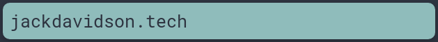
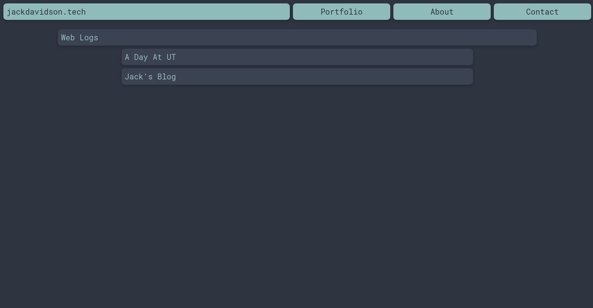

# blog



Newest version of my personal website/blog.

## installation
This blog is very simple to install, as of the writing of this guide (May 03),
blogs are stored in a filesystem store in the git repo. This *may* change to
using postgres in the future, stay tuned.

First, clone the repository on your server/development machine.
```
~/repos $ git clone https://github.com/jack-davidson/blog.git
```

Next, install `nodejs` using your GNU/Linux distribution's package manager.
```
~/repos/blog $ sudo pacman -S nodejs
```

Then, install the dependencies for this project.
```
~/repos/blog $ npm install
```

For convenience, install nodemon to read changes to files and restart the server.
```
~/repos/blog $ npm install -g nodemon
```

Finally, start the server and you are ready!
```
~/repos/blog $ nodemon
...
blog listening at http://localhost:3000
```

You can point your web browser to `http://localhost:3000` and the blog will be there!

